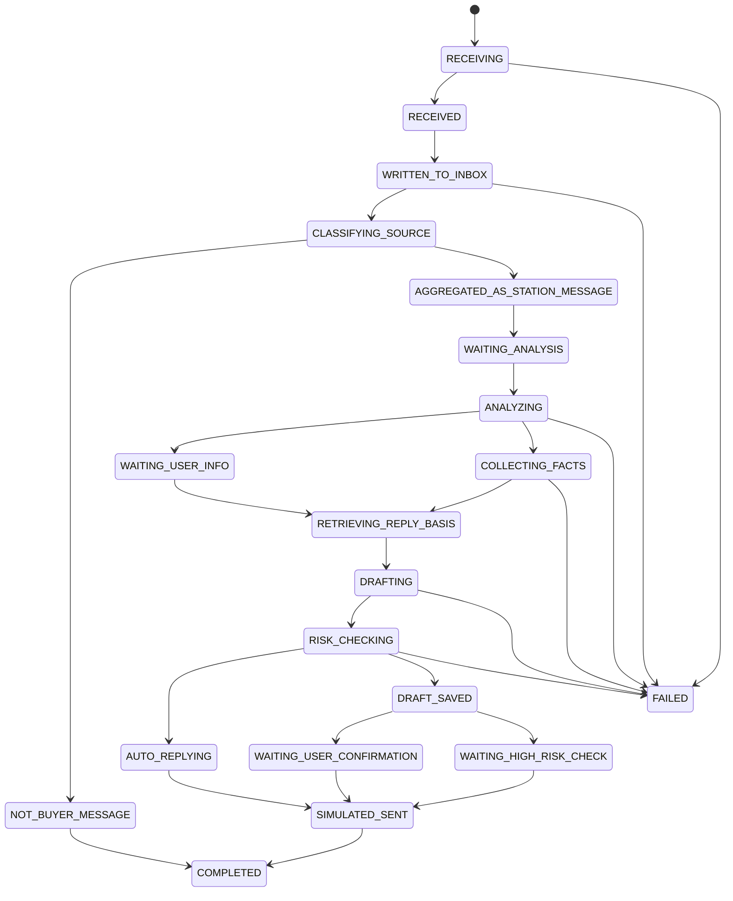

# ReplyFlow 状态目录 v1.0

> 本文件冻结阶段 1 的状态语言，避免后续代码、页面和评测各说各话。状态名优先使用英文枚举，页面文案使用中文。

## 1. 状态分层

ReplyFlow 有四层状态，不应混用：

| 层级 | 对象 | 作用 |
|---|---|---|
| 邮件接入状态 | `emails.status` | 记录原始邮件是否接收、写入和识别 |
| 聚合会话状态 | `aggregate_threads.status` | 记录顶部聚合站内信中的处理进度 |
| Agent 运行状态 | `task_runs.state` | 记录一次 Agent 处理的内部状态机 |
| 发送与审计状态 | `outbox`、`confirmations`、`audit_logs` | 记录草稿、确认、模拟发送和幂等 |

页面以聚合会话状态为主，右侧 Trace 展示 Agent 运行状态。

## 2. 邮件接入状态

| 状态 | 中文文案 | 进入条件 | 允许下一步 | 页面影响 |
|---|---|---|---|---|
| `RECEIVING` | 接收中 | 演示控制台通过校验后开始写入 | `RECEIVED`, `FAILED` | 可展示短暂进度 |
| `RECEIVED` | 已接收 | 邮件正文、主题、发件人生成完成 | `WRITTEN_TO_INBOX`, `FAILED` | 原始邮件对象已存在于内存或事务中 |
| `WRITTEN_TO_INBOX` | 已写入收件箱 | 邮件写入 SQLite `emails` | `CLASSIFYING_SOURCE`, `FAILED` | 原始收件箱计数 +1 |
| `CLASSIFYING_SOURCE` | 识别来源中 | 系统判断是否买家站内信 | `AGGREGATED_AS_STATION_MESSAGE`, `NOT_BUYER_MESSAGE`, `FAILED` | 详情栏显示识别中 |
| `AGGREGATED_AS_STATION_MESSAGE` | 已聚合为站内信 | 判断为买家站内信并创建聚合会话 | `WAITING_ANALYSIS`, `ANALYZING` | 顶部聚合站内信计数 +1，新会话置顶 |
| `NOT_BUYER_MESSAGE` | 非买家站内信 | 判断为平台通知或其他非回复对象 | `COMPLETED` | 只留在原始收件箱，不显示 AI 回复入口 |

空正文不进入状态机，直接返回错误 `EMAIL_EMPTY`。

## 3. 聚合会话状态

| 状态 | 中文文案 | 进入条件 | 页面按钮 | 是否计入待处理 |
|---|---|---|---|---|
| `WAITING_ANALYSIS` | 待分析 | 仅接收不处理，或自动运行未开始 | 无 AI 回复按钮，可展示“运行AI”入口 | 是 |
| `AI_ANALYZING` | AI分析中 | Agent 正在分析和查事实 | 按钮禁用 | 是 |
| `AI_REPLIED` | AI已回复 | 一级自动处理完成并写入本地 outbox | 无人工按钮 | 否 |
| `WAITING_USER_CONFIRMATION` | 待人工确认 | 二级草稿已生成 | `AI回复`、`模拟发送` | 是 |
| `WAITING_HIGH_RISK_CHECK` | 高风险核对 | 三级参考回复已生成 | `生成参考回复`、核对完成后 `我已核对，允许模拟发送` | 是 |
| `HUMAN_REPLIED` | 已人工回复 | 店管确认后二级或三级写入本地 outbox | 查看记录 | 否 |
| `FAILED` | 处理失败 | 工具、模型、解析、幂等冲突等不可继续错误 | 重试或切换模式 | 是，除非手动关闭 |
| `NOT_BUYER_MESSAGE` | 非买家消息 | 不属于买家站内信 | 无 AI 回复按钮 | 否 |

页面筛选项必须使用以上状态，不新增审核队列、工单状态或政策处理状态。

## 4. Agent 运行状态

| 状态 | 触发 | 主要动作 | 允许下一步 |
|---|---|---|---|
| `ANALYZING` | 聚合会话进入 Agent | 运行 `email_triage`，识别来源、意图、订单号、缺失字段 | `COLLECTING_FACTS`, `WAITING_USER_INFO`, `FAILED` |
| `WAITING_USER_INFO` | 缺订单号、图片、尺码等必要信息 | 准备澄清回复上下文 | `RETRIEVING_REPLY_BASIS`, `RISK_CHECKING` |
| `COLLECTING_FACTS` | 有足够实体可查 | 调用订单和物流工具 | `RETRIEVING_REPLY_BASIS`, `RISK_CHECKING`, `FAILED` |
| `RETRIEVING_REPLY_BASIS` | 需要组织回复 | 检索只读回复依据和语气指南 | `DRAFTING`, `RISK_CHECKING` |
| `DRAFTING` | 事实和依据准备完成 | Demo Router 或 Coze 生成英文草稿 | `RISK_CHECKING`, `FAILED` |
| `RISK_CHECKING` | 分析后或草稿后 | 本地风险网关判定 R0-R3 和 L1-L3 | `AUTO_REPLYING`, `WAITING_USER_CONFIRMATION`, `WAITING_HIGH_RISK_CHECK`, `FAILED` |
| `AUTO_REPLYING` | L1 且风险网关允许 | 系统生成 operation_id 并写入本地 outbox | `COMPLETED`, `FAILED` |
| `DRAFT_SAVED` | L2 或 L3 草稿保存 | 保存 AI 原稿和当前编辑稿 | `WAITING_USER_CONFIRMATION`, `WAITING_HIGH_RISK_CHECK` |
| `SIMULATED_SENT` | 店管确认或系统 L1 自动确认 | 写入本地 outbox、审计和幂等记录 | `COMPLETED` |
| `COMPLETED` | 流程完成 | 不再自动推进 | 无 |
| `FAILED` | 出错且无法自动恢复 | 记录错误码和 trace_id | 重试、切 Demo Mode 或人工处理 |

## 5. 允许状态流转

任何从 `WAITING_HIGH_RISK_CHECK` 到 `SIMULATED_SENT` 的流转，都必须满足核对清单全选和二次确认。任何从 `WAITING_USER_CONFIRMATION` 到 `SIMULATED_SENT` 的流转，都必须满足店管确认。

## 6. 错误码与处理

| 错误码 | 触发 | UI处理 | 风险处理 |
|---|---|---|---|
| `EMAIL_EMPTY` | 邮件正文为空 | 阻止提交，提示正文不能为空 | 不进入 Agent |
| `ORDER_NOT_FOUND` | 订单号查不到 | 生成澄清草稿 | R1 / L2 |
| `IDENTITY_CONFLICT` | 发件人与订单邮箱不匹配 | 显示冲突提示 | R2 / L3 |
| `TOOL_ERROR` | 本地工具失败 | 显示工具错误和 trace_id | R2 / L3 |
| `MODEL_ERROR` | Coze 调用失败 | 提示切回 Demo Mode 或重试 | 不自动发送 |
| `MODEL_OUTPUT_INVALID` | 模型输出无法按 Schema 解析 | 重试一次，失败后升级 | R2 / L3 |
| `BASIS_NOT_FOUND` | 回复依据无命中 | 显示依据不足 | R1 / L2；若邮件本身高风险则 R2 / L3 |
| `BASIS_CONFLICT` | 回复依据冲突 | 显示冲突依据 | R2 / L3 |
| `CONFIRMATION_REQUIRED` | 未确认即调用写工具 | 阻断发送 | 保持当前等级 |
| `DUPLICATE_OPERATION` | 同一 `operation_id` 同 payload 重试 | 返回历史结果 | 不新增 outbox |
| `IDEMPOTENCY_CONFLICT` | 同一 `operation_id` 不同 payload | 阻断并提示重新生成操作 | FAILED |

## 7. 计数规则

| 动作 | 原始收件箱 | 顶部聚合站内信待处理 | 发件箱 |
|---|---:|---:|---:|
| 空正文提交 | 不变 | 不变 | 不变 |
| 非买家消息接入 | +1 | 不变 | 不变 |
| 买家消息仅接收不处理 | +1 | +1 | 不变 |
| L1 自动回复完成 | +1 | 先 +1，完成后 -1 | +1 |
| L2 生成草稿 | +1 | +1 | 不变 |
| L2 店管发送 | 不变 | -1 | +1 |
| L3 生成参考回复 | +1 | +1 | 不变 |
| L3 未核对点击发送 | 不变 | 不变 | 不变 |
| L3 核对后发送 | 不变 | -1 | +1 |
| 重复提交同一发送 | 不变 | 不变 | 不变 |

## 8. Trace 记录要求

每次 Agent 运行必须写入 Trace，至少包括：

1. `task_id`、`thread_id`、运行模式；
2. 状态变化；
3. 每个工具名、输入摘要、输出摘要、耗时、状态和错误码；
4. Coze workflow 版本或 Demo Router 版本；
5. 风险网关命中的规则；
6. 店管确认动作和核对清单；
7. `operation_id` 和幂等结果。

日志不得记录 Coze PAT/Token、真实邮箱、真实订单或其他敏感信息。虚构邮箱展示时优先使用 `example.com`，页面可脱敏。

## 9. 状态自查

后续实现如果新增状态，必须先回答：

1. 这个状态属于邮件、聚合会话、Agent 运行还是发送审计；
2. 它从哪个状态进入，又能去哪个状态；
3. 页面如何展示；
4. 是否会引入取消项；
5. 是否需要新增测试。

不能解释清楚时，不得新增状态。
